# Thrust Vector Control Single Rotor UAV ''Goose''

## Electronics block diagram

## Program architecture

## Program state machine

## Mechanical design
Onshape 3D CAD model is available online [here](https://cad.onshape.com/documents/55f630da79af3dc846c30129/w/294f9dbf9e5691d9e0cefd31/e/d54b9355fb3a412a3e35e838).
